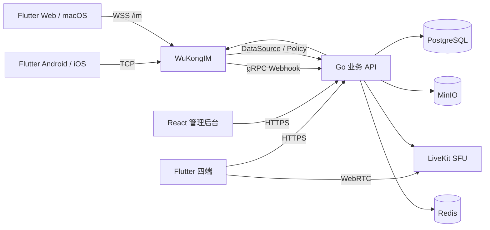

# 系统架构

## 当前边界

邻里通讯已经以 WuKongIM 作为唯一实时消息链路。Go 服务不再提供自研 WebSocket、消息 ACK 或离线同步协议。

- WuKongIM 固定为提交`a888f895`上的`v2.2.5-20260422-linli.3`可审计补丁构建，负责握手、Token、长连接、消息正文、消息 ID、频道序号、ACK、去重、离线消息、最近会话和多设备连接；补丁范围仅含类型5结构校验、持久流快照缓存同步、有界插件运行日志，以及连接、验签、消息发送、Token更新和首帧错误日志的敏感数据移除。
- Go 服务负责账号、好友、群和扩展频道权限、消息扩展、朋友圈、表情、客服、审核、推送、LiveKit 房间与后台管理。
- PostgreSQL 是业务资料、权限、扩展和持久任务的事实来源；不再作为客户端消息正文和离线同步的主链路。
- MinIO 保存全部附件和媒体。Redis 只保存缓存、限流和任务协调状态，不保存任何唯一消息副本。
- LiveKit 负责单聊/群聊音视频和屏幕共享；Go 服务只校验成员并签发短期 Token，不保存 SDP/ICE。

## 登录与消息路径

1. 客户端通过 `/v2/auth/*` 登录，获得业务 Access/Refresh Token 与 `ImSession`。
2. `ImSession` 只向对应平台返回 WuKong UID、短期派生 Token、设备标识和 TCP/WSS 地址。Android/iOS 使用完整 Flutter SDK 1.7.9，Web 使用 JS SDK 1.3.5，macOS 使用 Easy SDK 1.0.3。
3. 客户端用官方 SDK 连接 WuKongIM；连接成功和 ACK 只能由 SDK 事件确认，业务 API 不伪造在线或发送成功状态。
4. 发送前，签名白名单策略插件调用 Go 内网策略接口，校验好友、成员、禁言、封禁、敏感词、频道类型和消息类型。
5. WuKongIM 持久化消息并返回非零 `message_id`、`message_seq` ACK；接收方用同一 ID/序号去重并提交 RecvACK。
6. gRPC Webhook 在同一事务内幂等写入消息索引、在线状态投影和离线推送任务。事务提交前清空收件箱原始载荷，仅保留事件ID、状态和安全错误摘要；重复 Webhook 不产生重复业务记录，PostgreSQL不成为第二份消息正文库。
7. 编辑、撤回、回应、置顶、提醒和回执以 PostgreSQL 扩展为准。事务同时写 WuKong Outbox；CMD 仅通知客户端重新同步，不直接替代扩展事实。

客户端发送重试始终复用原 `clientMsgNo`。所有网关都透传 `noPersist`、`redDot`、`syncOnce` 与 `topic`；Android/iOS/Web 同时写 WuKong 原生 `expire`，四端正文统一携带绝对 `expiresAt`。Easy SDK未公开原生 `expire` 的 macOS 消息由 Webhook按该绝对时间建立同一到期任务。ACK丢失后重发不能生成第二条逻辑消息。

## 业务一致性

好友、群、频道、客服和持久业务事件采用 PostgreSQL 事务 + `im_wukong_outbox`：

- 数据库提交成功但 WuKong 调用失败时，状态保持待处理并按退避重试。
- worker 使用 PostgreSQL 租约和 `FOR UPDATE SKIP LOCKED`，过期租约可由另一实例接管。
- Reconciler 周期读取 PostgreSQL 权威快照，使用 reset/set 接口修复用户黑白名单、频道订阅者和频道权限。
- 相同幂等键不会重复创建 Outbox；服务端 4xx 永久错误进入失败状态，429、5xx 和网络错误重试。

## 媒体、通话与推送

客户端经短期预签名 URL 直传 MinIO，Go 服务确认所有权、大小、SHA-256 和 magic MIME 后才允许消息引用。该校验不是恶意文件扫描，正式发布仍需内容安全和病毒扫描服务。

通话邀请、接听、拒绝、离开和结束是版本化 WuKong CMD/持久通话事件；音视频和屏幕共享只在 LiveKit 内传输。推送 Outbox 只携带事件类型、未读/角标和有限路由 ID，不包含消息正文、位置、联系人或凭据。

## 部署与可用性声明

当前生产拓扑是单节点 WuKongIM、单 PostgreSQL、单 MinIO、单 Redis 和单 LiveKit，不宣称高可用。公网只开放 Caddy 80/443、WuKong TCP 5100 及 LiveKit 所需 TCP/UDP；WuKong 5001/5300、LiveKit 管理口、数据库、缓存、对象存储和监控只在内网。

未来扩容必须先完成 [性能门禁](WUKONGIM_PERFORMANCE_GATE.md) 和 [集群前置条件](CLUSTERING.md)，不能把增加 Go API 副本等同于消息或数据高可用。
