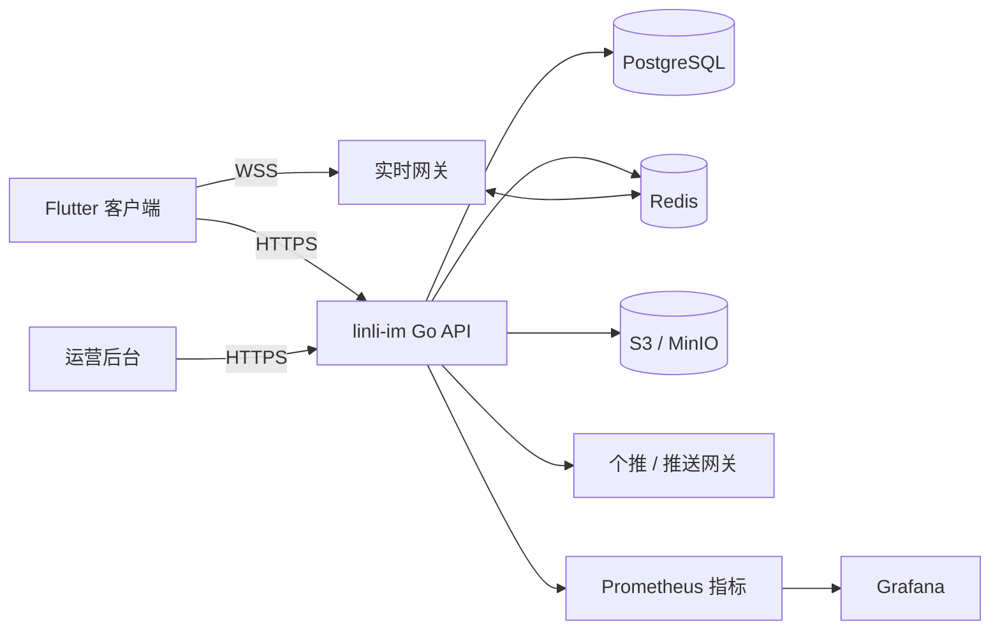

# 系统架构

## 设计原则

1. 服务端返回成功前，消息及对应同步事件必须持久化。
2. 客户端用 `client_msg_id` 保证重试幂等。
3. `conversation_seq` 定义会话内消息顺序。
4. `user_sync_seq` 提供用户维度连续、可恢复的离线事件游标。
5. WebSocket 负责低延迟，REST 同步负责断线后的最终正确性。
6. PostgreSQL Outbox 和用户同步游标保证持久事件；Redis 只承载可过期临时状态，不作为任何持久数据的唯一副本。
7. 用户端、运营后台和外部服务都视为不可信边界，权限由服务端校验。

## 运行拓扑

当前代码是可多副本运行的模块化单体：认证、好友、会话、群聊、消息、媒体、通话、公告、风控与后台位于清晰的 Go package 边界内。默认部署一个 IM 节点；容量增长时由 Caddy 动态发现多个相同节点。这样既避免早期跨服务分布式事务，也不把客户端协议绑定在单机上。

## 消息写入与同步

消息发送在一个 PostgreSQL 事务中完成：

1. 校验用户、会话成员关系、禁言/封禁和 payload。
2. 以发送人和 `client_msg_id` 检查幂等。
3. 锁定会话并分配下一条 `conversation_seq`。
4. 写消息、每位成员的同步事件、推送 outbox 和实时 event outbox。
5. 提交后返回 ACK；PostgreSQL `NOTIFY` 唤醒所有 IM 节点读取持久 Outbox，再投递各节点本地 WebSocket，推送 Worker 独立消费推送 Outbox。

客户端先保存本地发送态，再提交服务端；重连后按 `user_sync_seq` 拉取缺失事件，并以服务端消息 ID 去重。`NOTIFY`、Redis 或 WebSocket 短时失败都不会丢失已确认历史；后台还会周期扫描未完成 Outbox。

## 会话与群聊

- 单聊通过两位用户的稳定配对索引避免重复会话。
- 会话置顶、免打扰、手动未读和隐藏是用户独立偏好。
- 群角色、邀请、二维码、成员操作、禁言、公告和解散由 PostgreSQL 事务校验。
- 管理操作同时写审计、`group.system` 同步事件和历史可见系统消息。
- 群最大成员数由后台运行策略限制；容量扩大必须先有负载测试证据。

## 媒体与音视频

客户端通过短时预签名 URL 直传 S3/MinIO，服务端确认所有权、大小、状态和校验值后才允许发送媒体消息。消息只保存媒体描述，不保存二进制正文。

音视频使用 WebRTC。`im_call_sessions` 仅记录呼叫双方、状态、时间、时长与结束原因；SDP 和 ICE 只通过认证 WebSocket/Redis 转发，绝不写 PostgreSQL。STUN/TURN 是外部基础设施，应用服务不转发媒体流。

## 公告与推送

公告支持草稿、定时、置顶、全体/定向用户、已读、撤回和审计。多副本定时任务用数据库状态更新保证只发布一次。离线推送由 outbox 租约、重试和失败状态驱动。

个推在线通道使用安全透传；iOS APNs 和 Android 厂商通道使用通知消息。推送体只携带事件类型、未读/角标和路由 ID，不包含消息正文、好友验证文字、位置详情、联系人资料或密钥。

## 部署边界

生产 Compose 的 Web/API 只公开 Caddy 80/443。Caddy 终止 HTTPS/WSS，并路由 `/v1/*`、`/api/*` 和 `/health`。自建 Coturn 为 WebRTC 中继额外公开 3478 TCP/UDP 和 49160–49200 UDP；PostgreSQL、Redis、MinIO、Prometheus、Grafana、`/metrics` 与 `/ready` 不对公网暴露。本地业务与数据服务仅绑定 `127.0.0.1`。

## 扩展路线

同机多副本和跨主机扩展方案见 [CLUSTERING.md](CLUSTERING.md)。

达到单机容量边界后，优先顺序是：

1. 将 PostgreSQL、Redis 和对象存储迁移到具备高可用与备份能力的托管服务。
2. 在同一数据库与 Redis 上扩展多个无状态 API/实时实例。
3. 根据队列积压拆分推送与媒体扫描 worker。
4. 只有在事务边界和观测数据清晰后再拆分消息服务。

任何扩容都必须验证重连风暴、慢连接、Redis 故障、数据库连接预算、同步游标连续性和 24 小时资源增长。
