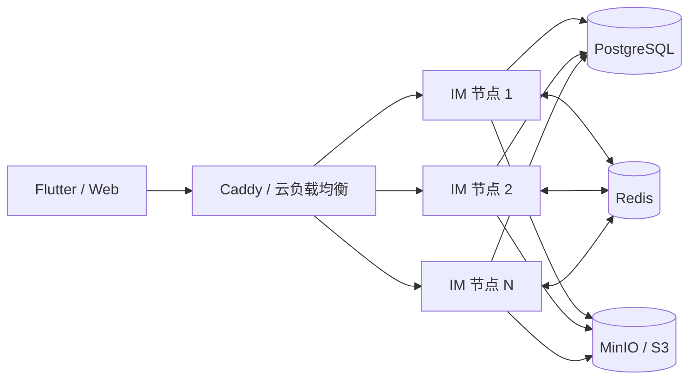

# IM 节点集群与横向扩展

## 目标

客户端始终只连接统一 HTTPS/WSS 地址。IM 节点从 1 个增加到 2、3 或更多时，Flutter 协议、消息表和历史数据都不需要迁移。



## 已实现的集群边界

- HTTP JWT 无服务端粘性会话，任意请求可进入任意节点。
- 每个节点仅保存自己承载的 WebSocket 连接，不共享连接对象。
- 消息、会话序号、用户同步序号、持久事件 Outbox 和推送 Outbox 在一个 PostgreSQL 事务提交。
- `clientMsgId` 使用数据库约束与事务锁实现跨节点幂等。
- PostgreSQL `LISTEN/NOTIFY` 只负责低延迟唤醒；每个节点周期扫描未完成 Outbox，因此通知丢失可以恢复。
- Redis 原子计数提供跨节点登录、验证码、搜索和请求频率预算；Redis 故障期间保留本机保护，同时 readiness 报警。
- 输入状态等允许过期的事件走 Redis Pub/Sub；聊天消息不依赖 Pub/Sub 保证完整性。
- 推送、公告、好友申请超时和通话超时使用事务或 `FOR UPDATE SKIP LOCKED`，多节点不会重复处理同一任务。
- 媒体由客户端直传共享 S3/MinIO，IM 节点不保存本地上传文件。
- Caddy 使用 Docker DNS 动态发现 `server` 服务副本，并采用最少连接策略；WebSocket 不要求粘性会话。

## 当前服务器扩容

集中配置保持默认：

```dotenv
IM_REPLICAS=1
```

需要同机扩容时先确认 PostgreSQL 连接、CPU 和内存，再改为 `2` 或 `3`：

```bash
cp -a /data/linli-im/shared/config.env /data/linli-im/backups/config.env.before-scale
sed -i 's/^IM_REPLICAS=.*/IM_REPLICAS=2/' /data/linli-im/shared/config.env
linli-im deploy
linli-im status
linli-im smoke
```

不要直接复制数据库、Redis 或 MinIO 容器。横向增加的是无状态 `server` 节点；数据服务的高可用是下一层独立方案。

## 跨主机阶段

当单台机器的 CPU、网络或连接数成为瓶颈时：

1. 将 PostgreSQL 切换到主备或托管高可用服务。
2. 将 Redis 切换到具备自动故障转移的高可用服务。
3. 将 MinIO 切换为分布式 MinIO 或兼容 S3 的对象存储。
4. 在多台主机或 Kubernetes 上运行相同 `linli-im-server` 镜像。
5. 公网入口改为云负载均衡，健康检查使用 `/ready`。
6. 按实例数重新计算数据库连接池：当前每节点最多 20 条连接。

## 扩容验收

- 并发发送的 `conversationSeq` 连续且不重复。
- 相同 `clientMsgId` 同时打到不同节点只生成一条消息。
- 任意节点重启后，客户端按 `userSyncSeq` 补齐全部事件。
- WebSocket 分布在不同节点的两位用户可以互收消息、回执和通话信令。
- Redis 暂停期间已确认聊天消息不丢失；恢复后临时功能自动恢复。
- 推送 Outbox、公告和超时任务没有重复执行。
- 滚动发布期间 HTTPS、WebSocket 重连和后台管理可用。
- 数据库总连接数、P95/P99 延迟、Outbox 积压和重连峰值在阈值内。

同机副本用于吸收 CPU 和连接压力，不等于高可用；真正的高可用必须把节点和数据副本分布到不同故障域。
